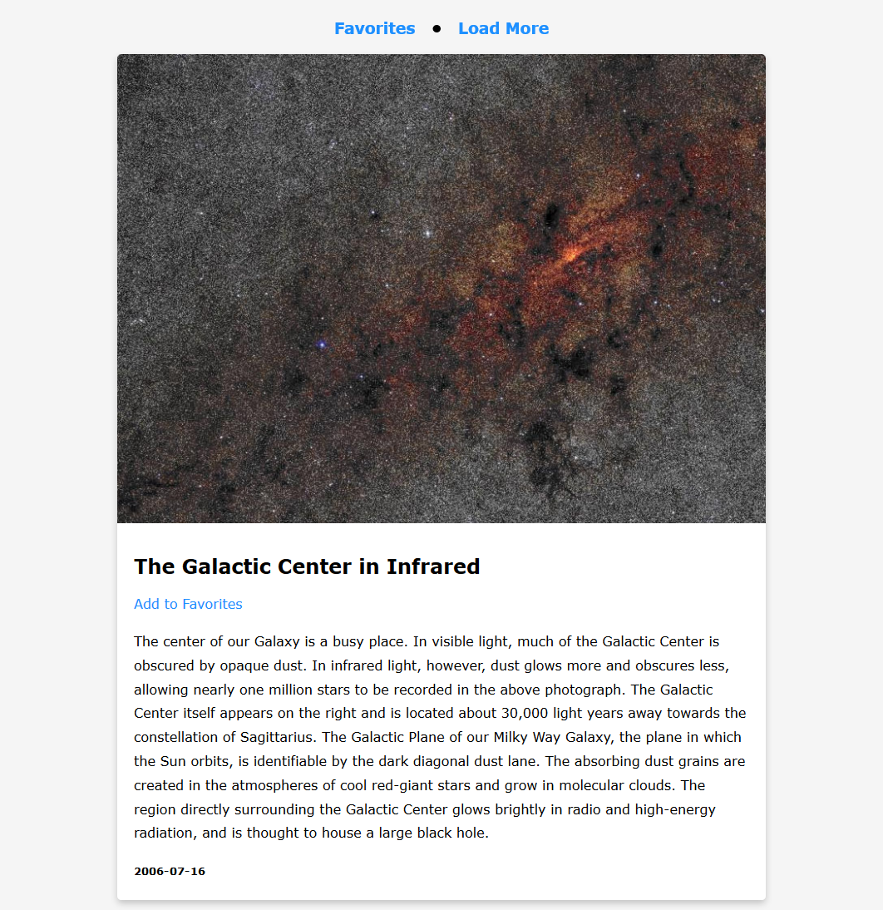

# NASA APOD Project

If you don't know, APOD stands for Astronomy Picture of the Day, which is of the Open APIs from NASA. You can find more about it [here](https://api.nasa.gov/).

This application basically has 2 pages. One is for loading new pictures received from the API everytime **Load More is clicked**. The other one is for keeping your favorite shots, which is kept in the [browser local storage](https://developer.mozilla.org/en-US/docs/Web/API/Window/localStorage).

**Each time the user clicks Load More**, a new request is sent to the APOD API and 10 new pictures will be returned and displayed on the page. While fetching, an animated SVG icon will be shown to inform the user.

**When the user adds a picture to his/her favorites**, a confirmation message is shown at the lower right corner of the screen and disappears after a 2-second delay. His/her favorites can be viewed by clicking **Favorites** in the top navigation bar. 

## Live Demo

Try it out **[here](https://tylernnguyen5.github.io/nasa-apod-project/)**

## What I used for this project

- [APOD](https://api.nasa.gov/) (NASA API)
- [Loaf](https://getloaf.io/) (An animated SVG icon library)

## How to try it out yourself locally

- Simply clone the project
- Use **Live Server** or similiar extension to view it in the browser

*Notes: You might need to update the 'apiKey' variable with your API Key or 'DEMO_KEY' in order to make a valid request (in **script.js**). For more, please check out the documentation [here](https://api.nasa.gov/)*
